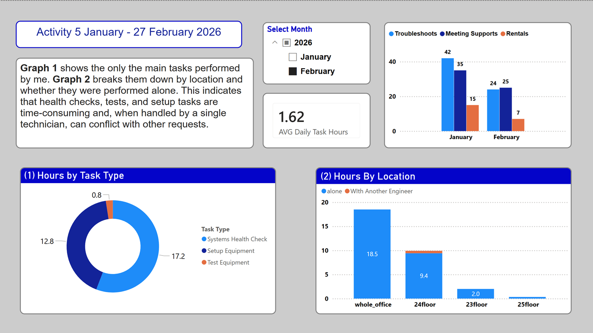
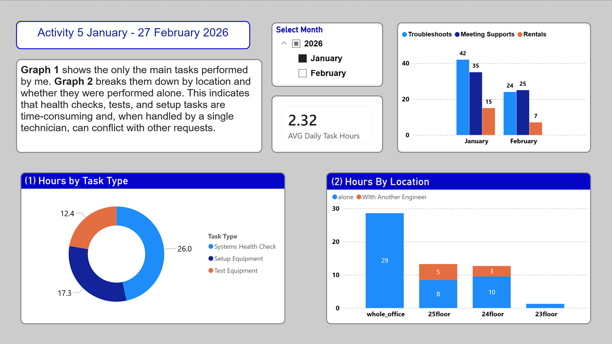
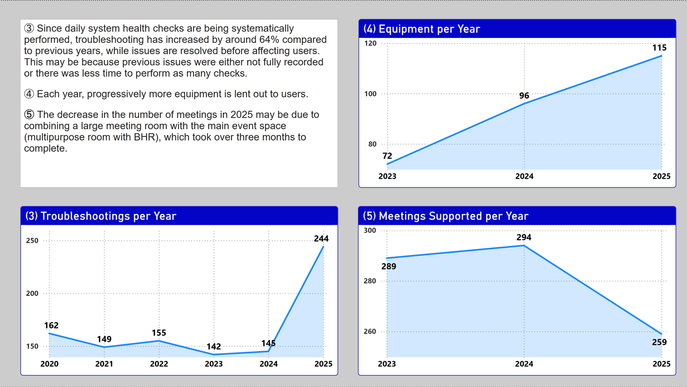

AV Support Workload Analysis — Tokyo Office
Overview
A data-driven analysis of AV support operations at a global consulting firm's Tokyo office, built to answer one question:
"Does adding a second technician lead to better outcomes — and can we prove it with data?"
For six years, this role was staffed by one person. In January 2025, a second technician was temporarily assigned to measure the difference. This project presents the findings.

Data
All data was manually recorded every working day from January 5 to February 27, 2026. Each entry includes date, location, task type, duration, and whether it was done solo or with the second technician.
Key Findings
Metric	January	February
Troubleshoots	42	24
Meeting Supports	35	25
Equipment Rentals	15	7
Avg Daily Task Hours	2.32	1.62
Health checks, testing, and setup take time and conflict with other requests when one person handles everything.
Year-over-Year (2020–2025)
Troubleshooting up ~64% (142 → 244) — issues caught early through daily health checks
Equipment Rentals up ~60% (72 → 115) — growing user demand
Meeting Supports dipped in 2025 (294 → 259) — likely due to a 3-month room renovation
Conclusion
One technician can't keep up. Health checks alone take 2+ hours daily across multiple floors, leaving no room for meetings, setups, and ad-hoc requests. The data supports a two-technician model.
Tools
Excel · Power BI
